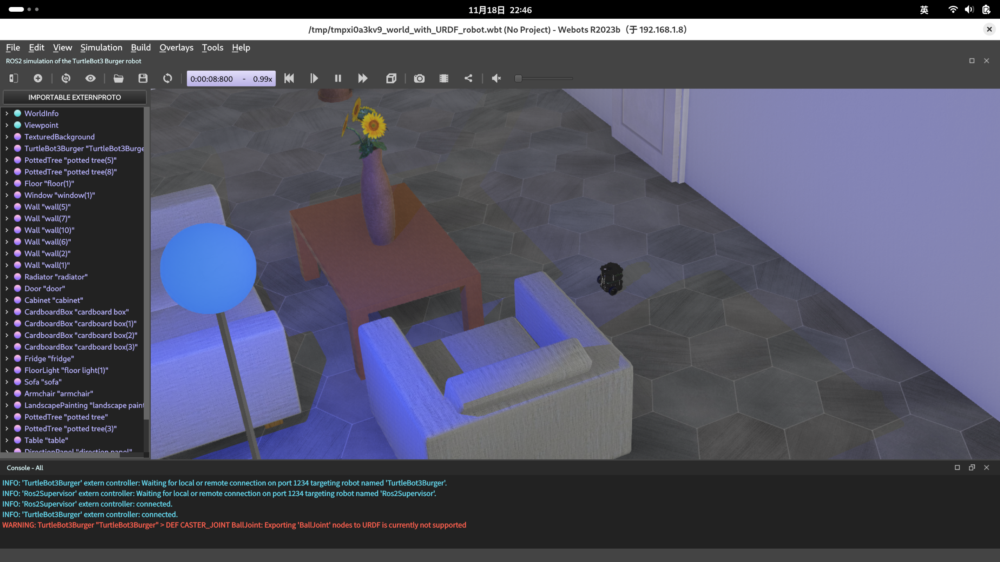

# AMR Remote Control Toolkit

By using this package, you can achieve below functions by sending topic for your 2D AMR:

- launch slam algorithm
- save map
- load map files and launch amcl

It is encouraged to use [legubiao/ros2d-quasar](https://github.com/legubiao/ros2d-quasar) as well.

[中文说明](README_CN.md)

## 1. Installation

* clone the repository
  ```shell
  cd ~/ros2_ws/src
  git https://github.com/legubiao/amr_rctk
  ```

* rosdep
  ```bash
  cd ~/ros2_ws
  rosdep install --from-paths src --ignore-src -r -y
  ```


* python node 
  ```bash
  chmod +x scripts/mapping_node.py
  ```

* build

  ```bash
  cd ~/ros2_ws
  colcon build --packages-up-to amr_rctk  --symlink-install
  ```

## 2. Simulations

### 2.1 Turtlebot3 Webots Simulation

Tested on Ubuntu 22.04 ROS2 Humble.
> **Warning:** Webots still under development for ROS2 Jazzy, can not run properly (2024.11.18)
* Install [Webots](https://github.com/cyberbotics/webots), just download the stable release `.deb` then install.
* Install Webots-ros2
  ```bash
  sudo apt-get install ros-humble-webots-ros2
  ```
* Test the turtlebot3 simulation
  ```bash
  ros2 launch webots_ros2_turtlebot robot_launch.py
  ```



* Launch the amr_rctk
```bash
source ~/ros2_ws/install/setup.bash
ros2 launch amr_rctk turtlebot.launch.py
```